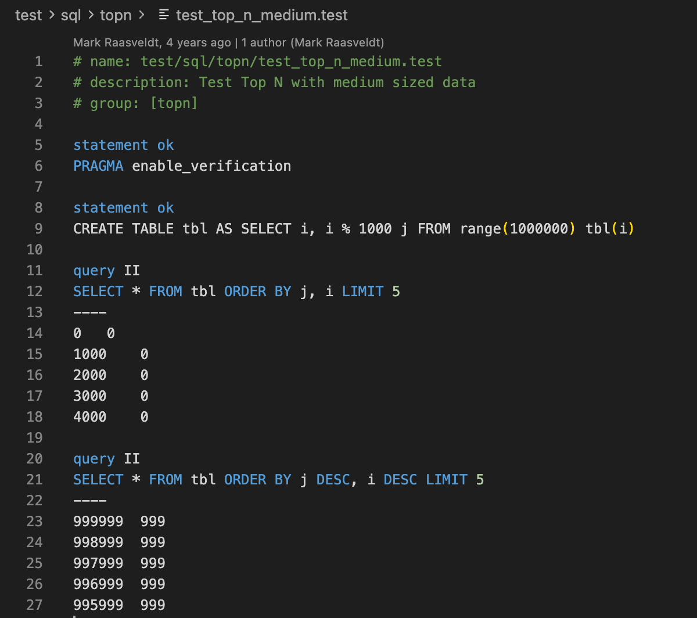

# vscode-sqllogictest

> This is a fork of [benesch/vscode-sqllogictest](https://github.com/benesch/vscode-sqllogictest) that has been modified to work with recent versions of VSCode & Cursor. We also added the support of the DuckDB dialect for the syntax highlighting.

This is an extension for [Cursor](https://www.cursor.com/) and [Visual Studio Code](https://code.visualstudio.com/) that provides language
support for [sqllogictest], a text-driven testing framework for SQL databases.

## Features

The headline feature of this extension is syntax highlighting for sqllogictest
scripts:

Because there is no standard file extension for sqllogictest scripts,
`vscode-sqllogictest` will run some heuristics on plaintext files to determine
whether to place them into sqllogictest mode. These heuristics are fairly
primitive, so please file issues if you find sqllogictest files that are not
detected as such, or vice versa.

## Installation

Until the extension is published to the VSCode Extension & Open VSX Marketplaces, you can install it downloading the [latest release](https://github.com/altertable-ai/vscode-sqllogictest/releases/latest) and installing it manually drag-n-dropping the `sqllogictest-x.y.z.vsix` file into your Cursor or VSCode extensions panel.
